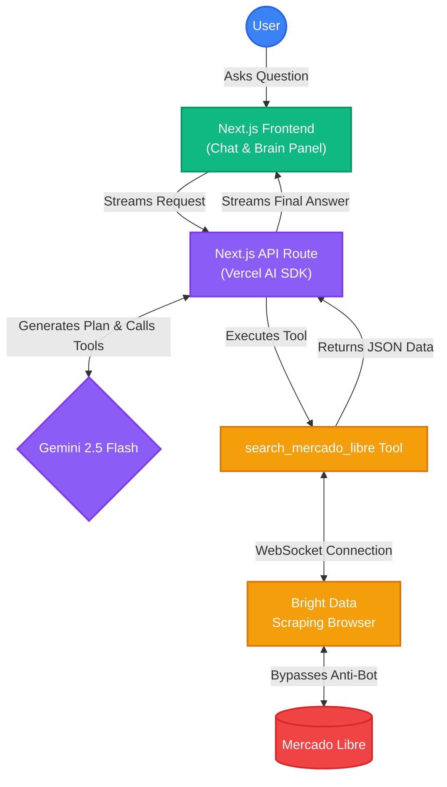

# 🛒 BuyBoxAgent - Competitive Intelligence E-Commerce AI

<div align="center">

[](https://nextjs.org/)
[](https://www.typescriptlang.org/)
[](https://tailwindcss.com/)
[](https://brightdata.com/)
[](https://sdk.vercel.ai/)
[](https://deepmind.google/technologies/gemini/)

*An AI-powered Market Intelligence Agent built for the Bright Data Hackathon.*

</div>

## 📖 Overview

**BuyBoxAgent** is a sophisticated, autonomous AI agent designed for e-commerce sellers (focusing on Mercado Libre). It acts as your personal competitive intelligence analyst. 

By leveraging **Bright Data's Scraping Browser**, the agent can bypass severe anti-bot protections to extract real-time competitor prices, shipping methods (like "Envío Full"), and product positioning. It then analyzes this data to tell you *exactly* why you are losing sales and how to regain the Buy Box.

### 🌟 Key Features

- **Real-Time Web Scraping**: Extracts live data from Mercado Libre, evading bot detection.
- **"Brain Panel" UI**: Watch the AI "think" in real-time as it plans, executes tools, and observes results.
- **Autonomous Tool Execution**: The agent decides when and how to search for competitors without human hand-holding.
- **Premium UX/UI**: Built with Next.js App Router and Tailwind CSS for a seamless, beautiful experience.

---

## 🏗️ Architecture

The system uses a modern Server-Side Rendered (SSR) approach with streaming AI responses.



---

## 🚀 Getting Started

### 1. Prerequisites
- Node.js 18+
- Active Bright Data Account (Scraping Browser Zone enabled)
- Google Gemini API Key

### 2. Installation

Clone the repository and install dependencies:

```bash
git clone https://github.com/JaDi03/BuyBoxAgent.git
cd BuyBoxAgent
npm install
```

### 3. Environment Variables

Create a `.env.local` file in the root of the project with the following keys:

```env
# LLM (Gemini 2.5 Flash)
GOOGLE_GENERATIVE_AI_API_KEY="your-gemini-api-key"

# Bright Data Scraping Browser
BRIGHT_DATA_AUTH="your_user:your_password"
BRIGHT_DATA_HOST="brd.superproxy.io:9222"
BRIGHT_DATA_WS_ENDPOINT="wss://${BRIGHT_DATA_AUTH}@${BRIGHT_DATA_HOST}"
```

### 4. Run the Development Server

```bash
npm run dev
```

Open [http://localhost:3000](http://localhost:3000) with your browser to see the result.

---

## 🛠️ Built With

- **[Next.js 15](https://nextjs.org/)** - React Framework
- **[Vercel AI SDK](https://sdk.vercel.ai/docs)** - AI Streaming & Tool Management
- **[Bright Data](https://brightdata.com/)** - Web Scraping Infrastructure
- **[Puppeteer Core](https://pptr.dev/)** - Browser Automation
- **[Tailwind CSS](https://tailwindcss.com/)** - Styling
- **[Lucide React](https://lucide.dev/)** - Icons

---
*Developed for the Web Data UNLOCKED Hackathon.*
